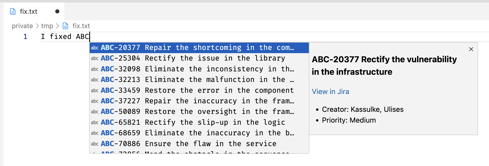

# Language Server for Jira and Visual Studio Code

A language server for integrating Jira within Visual Studio Code.



## Table of Contents

- [Language Server for Jira and Visual Studio Code](#language-server-for-jira-and-visual-studio-code)
  - [Table of Contents](#table-of-contents)
  - [Introduction](#introduction)
  - [Features](#features)
  - [Installation](#installation)
    - [Prerequisites](#prerequisites)
    - [Steps](#steps)
  - [Usage](#usage)
  - [Configuration](#configuration)
  - [Contributing](#contributing)
  - [License](#license)

## Introduction

The Language Server for Jira provides integration with Jira, allowing you to interact with Jira issues directly from your development environment. This extension uses the Language Server Protocol (LSP) to provide features such as code completion and issue linking.

## Features

- Code completion for Jira issues
- Automatic linking of Jira issues in markdown files
- Customizable server settings

## Installation

### Prerequisites

- [Node.js](https://nodejs.org/)
- [npm](https://www.npmjs.com/)

### Steps

1. Clone the repository:

```sh
git clone https://github.com/ahpex/languageserver-jira.git
cd languageserver-jira
```

2. Install dependencies:

```sh
npm install
```

3. Build the project:

```sh
npm run compile
```

## Usage

To start using the Language Server for Jira, open your development environment and activate the extension. The server will automatically start and provide Jira integration features.

## Configuration

You can configure the extension by adding the following settings to your VS Code settings:

```json
{
    "languageserver-jira.hostname": "your-jira-hostname",
    "languageserver-jira.authorizationToken": "your-authorization-token",
    "languageserver-jira.project": "your-project-key",
    "languageserver-jira.sslCertificateCheck": true
}
```

Example:

```json
{
    "languageserver-jira.hostname": "jira.example.com",
    "languageserver-jira.authorizationToken": "your-auth-token",
    "languageserver-jira.project": "ABC",
    "languageserver-jira.sslCertificateCheck": false
}
```

If you don't want to use a productive Jira server, you can use [Jira REST Mock Server](https://github.com/ahpex/jira-rest-mock-server).

## Contributing

Contributions are welcome! Please follow these steps to contribute:

1. Fork the repository.
2. Create a new branch for your feature or bugfix.
3. Commit your changes.
4. Push your branch and create a pull request.

## License

This project is licensed under the MIT License. See the [LICENSE](./LICENSE) file for details.
